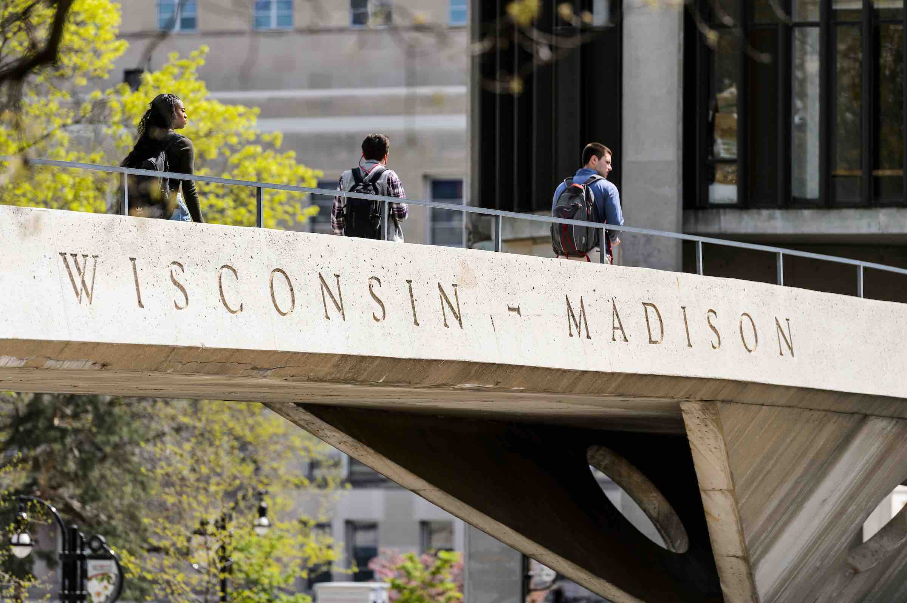

# Career Resources

## Awards

For awards that require nominations, please submit the name of the
award, due date and application materials (excluding reference
letters) to [Dana Maltby][mailto:dmaltby@wisc.edu] by email at least a
month in advance. Please make sure you follow the instructions for
nomination materials
exactly.

For awards that do not require nominations, please email the name of
the award and due date to [Dana Maltby][mailto:dmaltby@wisc.edu], so
that we can track applications and outcomes.

### [UW-Madison Outstanding Women of Color Awards][https://diversity.wisc.edu/2020/05/call-for-nominations-2020-21-uw-madison-outstanding-women-of-color-awards/]

The UW–Madison Outstanding Women of Color Awards acknowledge and honor
women of color among UW-Madison faculty, staff, students
(undergraduate or post-baccalaureate) and in the Greater Madison
community, who have made outstanding contributions in one or more of
the following areas: social justice, activism, and advocacy on behalf
of disadvantaged, marginalized populations; community service;
scholarly research, writing, speaking and/or teaching on race,
ethnicity, and indigeneity in U.S. society; community building on- or
off-campus, to create an inclusive and respectful environment for all.

*Deadline: September, 2020*

### [Capstone PhD Teaching Award][https://grad.wisc.edu/teaching-assistant-awards/]

Recognizes TA’s who have performed as outstanding teachers through
their UW-Madison tenure.

*Deadline: November, 2020*

### [Early Excellence in Teaching][https://grad.wisc.edu/teaching-assistant-awards/]

Award recognizes outstanding and inspirational performance on the part
of TA’s with fewer than four semesters of teaching experience.

*Deadline: November, 2020*

### [Exceptional Service Award][https://grad.wisc.edu/teaching-assistant-awards/]

 Recognizes TA’s who perform exceptional service related to the
 educational mission of their department and our university
 (volunteerism, committee work, mentoring, etc.) in addition to the
 regular duties.
 
*Deadline: November, 2020*

### [Innovation in Teaching Award][https://grad.wisc.edu/teaching-assistant-awards/]

Recognizes TA’s who bring extraordinary creativity to their work and
have developed or adapted teaching methods or techniques in new and
innovative ways.

*Deadline: November, 2020*

### [American Statistical Association Student Paper][https://www.amstat.org/ASA/Your-Career/Student-Paper-Competitions.aspx]

The winners of best paper competitions earn travel awards to
ASA-sponsored conferences. Requires JSM registration. See each ASA
section websites for details.

*Deadline: December 15, 2020*

## Fellowships

* [Facebook Fellowship Program][fb]
* [NSF Graduate Fellowship Program][nsf]
* [National Defense Science and Engineering Fellowship][ndsef]
* [Ford Predoctoral Fellowship][ford]
* [Hertz Foundation Predoctoral Fellowship][hertz]
* [National Physical Science Consortium Fellowship][npscf]
* [John J. Bartko Scholarship Award][barto]

[fb]: https://research.fb.com/programs/fellowship/
[nsf]: https://www.nsfgrfp.org/
[ndsef]: https://ndseg.asee.org/
[ford]: http://sites.nationalacademies.org/PGA/FordFellowships/PGA_047958
[hertz]: http://hertzfoundation.org/dx/fellowships/fellowshipaward.aspx
[npscf]: http://www.npsc.org/index.html
[barto]: https://www.amstat.org/ASA/Your-Career/Awards/John-J-Bartko-Scholarship-Award.aspx

## Jobs

Keep an eye out on the emailing lists. There are plenty of job opportunites
that are distributed through those channels. You can also ask your advisor for some direction as well.

There are a few places that maintain a list of jobs:

* [ASA List][asa-jobs]

[asa-jobs]:http://jobs.amstat.org/jobs

## Student Paper Awards

* [International Biometric Society Young Statisticians Award][ibc]
* [Institute of Mathematical Statistics Travel Award][ims]
* [Statistical Modeling Society][sms]
* [WNAR Student Paper Competitions][wnar]
* [ENAR Distinguished Student Paper Awards][enar]
* [Society for Clinical Trials Student Scholarship][sct]
* [JSM student paper][jsm]
* [International Association for Official Statistics][iaos]

[wnar]:http://www.wnar.org/Student-Competition
[enar]:https://www.enar.org/meetings/StudentPaperAwards/
[sms]:http://www.statmod.org/files/others/ToyotaAwardAnnouncement.pdf
[ims]:http://imstat.org/awards/hannan.html
[ibc]:https://www.biometricsociety.org/2017/10/call-for-papers-young-statistician-showcase-at-ibc2018-barcelona-spain/
[sct]:http://www.sctweb.org/public/about/chalmers.cfm
[jsm]:https://www.amstat.org/ASA/Your-Career/Student-Paper-Competitions.aspx?hkey=6481db83-6316-44b1-be71-d4796b76f583
[iaos]:http://www.oecd.org/iaos2018/

## Poster Competitions

* [New England Statistics Symposium][ness]
* [International Chinese Statistical Association][icsa]

[ness]: https://symposium.nestat.org/awards.html#ibmpaper
[icsa]: http://www.icsa.org/icsa/

## General Advice

* [Advice for success][breakout-advice] from successful people in all different fields. Mostly indust
ry oriented.
* [Career advice][career-advice] from Terrance Tao, with a curated list of other links to life advice
.
* [Statistical Career Advice][statistical-career-advice] from Michael Steele. Somewhat broad but enli
ghtening.
* [Statistical Challenges][statistical-challenges] General challenges that face statistics as a field

[breakout-advice]:https://breakoutcareers.com
[career-advice]:https://terrytao.wordpress.com/career-advice/
[statistical-career-advice]:http://www-stat.wharton.upenn.edu/~steele/Rants/AdviceGS.html
[statistical-challenges]:https://www.math.ucdavis.edu/~tracy/courses/math280/nsf_report.pdf

[appeal](appeal.md ':include')
