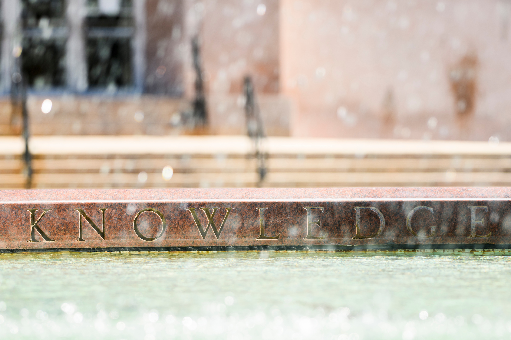

# [Master's Exam](https://www.stat.wisc.edu/phd-masters/masters-exam)

* [Boston University Qualifiers][buma]
* [University of Massachusetts, Amherst, Qualifying Exams][umassqual]
* [Duke Past Qualifying Exams][duke]
* [University of Maryland, Past Qualifying Exams][maryland]
* [Central Michigan University, Past Qualifying Exams][cmich]

# [PhD Qualifying Exam](https://www.stat.wisc.edu/phd-masters/PhD_Exam_Syllabus)

* [Yale Sample][yalephd]
* [University of Florida, 2010 PhD Qualifying Exam][uflphd]
* [University of Massachusetts, Amherst, Qualifying Exams][umassqual]
* [Duke Past Qualifying Exams][duke]
* [University of Maryland, Past Qualifying Exams][maryland]
* [Carnegie Mellon University, Sample Qualifying][cmuphd]
* [Central Michigan University, Past Qualifying Exams][cmich]
* [UNC, Chapel Hill, Past Comprehensive Exams][unc]
* [University of New Mexico, Past Comprehensive Exams][unm]
* [University of Florida, Past PhD Probability Exams][ufprob]

[yalephd]:https://statistics.yale.edu/academics/graduate-programs/phd-program/qualifying-exams
[uflphd]:http://www.stat.ufl.edu/~jhobert/oldphdexams_stuff/august_2010.pdf
[umassqual]:https://www.math.umass.edu/graduate/sample-qualifying-exams
[duke]:https://www2.stat.duke.edu/programs/grad/fye/
[buma]:http://www.bu.edu/stat/graduate-program-information/past-ma-qualifying-exam-questions/
[maryland]:https://www-math.umd.edu/quals.html
[cmuphd]:https://stat.cmu.edu/Exams/phd-stat-2008.pdf
[cmich]:https://www.cmich.edu/colleges/cst/math/Pages/Qualifying-Exams.aspx
[unc]:https://stat-or.unc.edu/resources/past-stat-cwe
[unm]:http://math.unm.edu/graduate/past-qualifying-exams-statistics
[ufprob]:http://gma.math.ufl.edu/past-exams/phd-probability/

