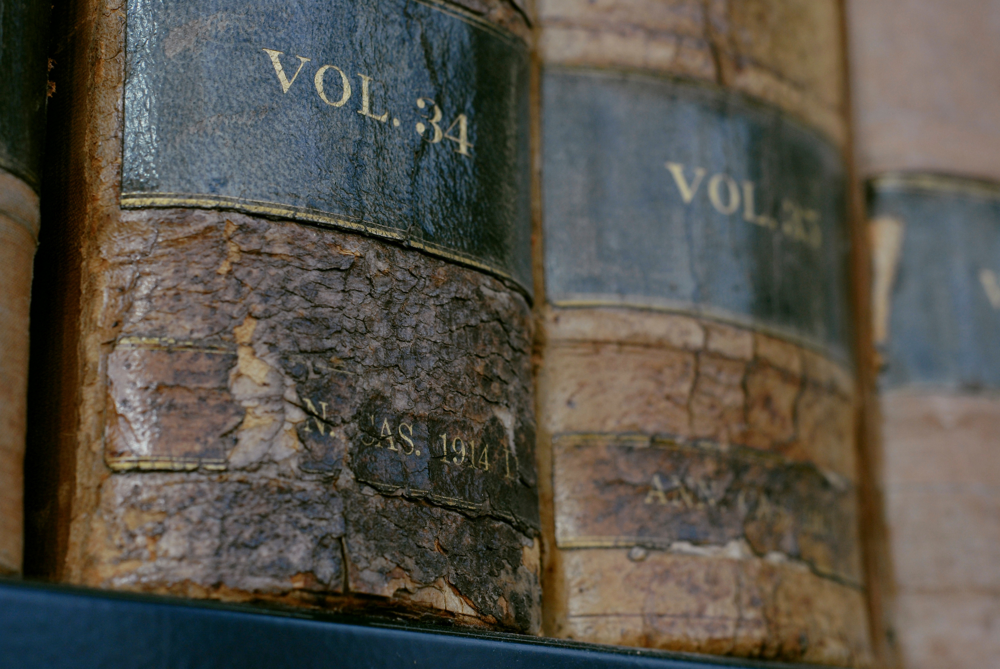

# Recommended Textbooks

### Linear Regression

* *Applied Linear Statistical Models by Kutner, Nachtsheim, and Neter* seems to be a silent favorite if you are new to linear regression. It's a big book, and fairly detailed. Also contains experimental design stuff. Suitable for students wishing to learn linear regression from outside of statistics as well.
* *Linear Models in Statistics, Rencher and Schaalje*. If you're a graduate student new to regression, this is a good place to start. Develops a rigorous and step-by-step framework for classic linear regression. The book is used for parts of Stat849. 

### Experimental Design

* *A First Course in Experimental Design, Oehlert*. Great introduction to experimental design. Very readable.
* *Analysis of Messy Data, Milliken and Johnson*. This book seems to be a classic, but I wouldn't recommend learning from it. I found it a little difficult to work through. Beware, there are quite a few errors in the book too, so find an errata.

### Mathematical Statistics

* *Mathematical Statistics, Jun Shao*. This is the book you will use for
  Stat709/710, written by our very own Jun Shao. The book requires some working
  knowledge of measure theoretic probability.
* *Theory of Point Estimation, Lehmann and Casella*. This book seems to be a
  popular reference for PhD level statistical theory. It's well written and
  covers many topics somewhat concisely.
* *Statistical Inference, Casella and Berger*. This book is written at a
  Masters level and is (in my opinion) one of the best books to begin learning
  graduate level statistics. The chapter contents are helpful, but most of the
  learning is from doing the problems.
* *Mathematical Statistics: Basic Ideas and Selected Topics, Bickel and
  Doksum*. Older classic book on statistical inference. This is probably the
  book that you will use if you take Stat610.

### Statistical Computing

* *Computational Statistics, Givens and Hoeting*. Great overview text for model-based approaches.
* *Elements of Statistical Computing, Thisted*. Reads well for the classic methods. Highly recommended for Stat771. Used to be required.
* *Advanced R, Wickham*. Self explanatory, great if doing any serious programming in R.

### Machine Learning

* *Machine Learning, Tom Mitchell*. Old standard on Machine Learning. Written concisely, but starts from the basic foundations.
* *Pattern Recognition and Machine Learning*. Covers the basics fairly thoroughly. Examples and narrative are straight-forward.
