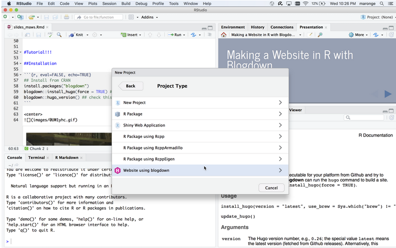
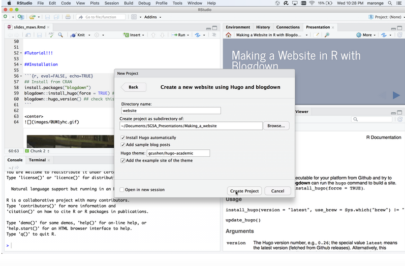
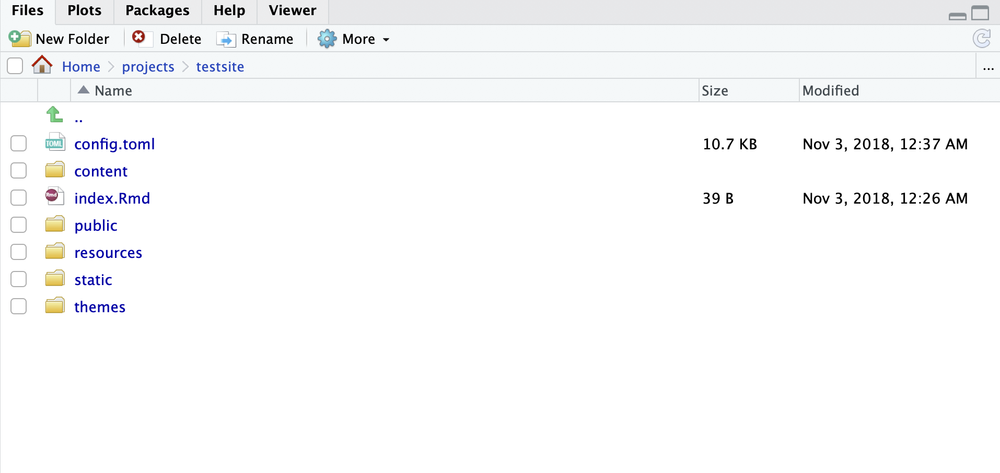
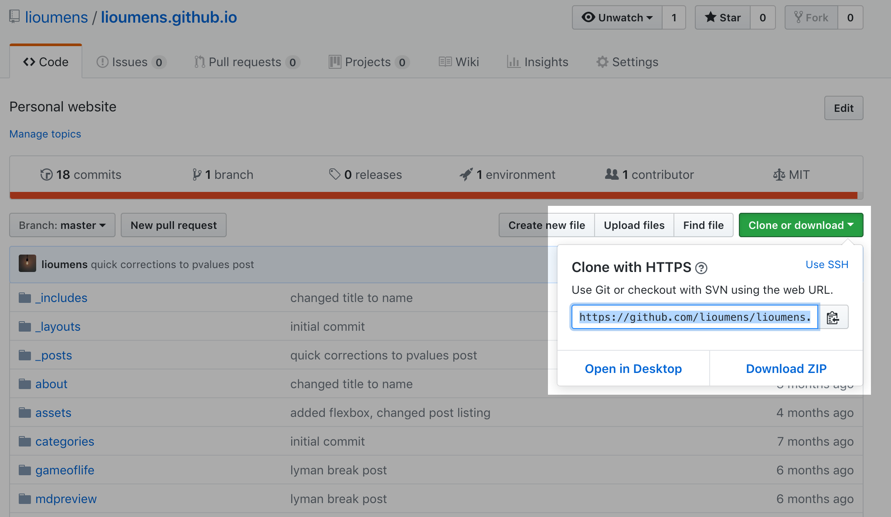

# Making a Website in R (Tutorial)

We think it's important as a graduate student to make your work available
online so that it's easily discoverable by others. A great way to present
this information is with a personal website, which is what we aim to show
here. We will walk through all the steps assuming minimal background and
knowledge about how the web works.

## Arc of the Tutorial

The arc of creating a website is this: We use Hugo (a static site generator)
to generate the html/css/javascript files that contain our website. The files
are only local to your computer right now, and are not on the internet. We
then find a web host (server) that will "serve" your website to whoever types
the appropriate website URL into an internet browser. We will use Github as a
host first, and then if you'd like to transfer to a different host you can.
In order to make updating your website easier, we recommend using Git to
version control your website, and track your changes. Finally, if you would
like a custom domain name, you will need to purchase the domain and update
the host records.

Of course, there are many ways to make a website, but we think this is best
and easiest and most sustainable way to keep a website as a modern
statisitician. If you think there's a better way, please contact the SGSA
technology committee.

#### Slides from SGSA Workshop

This guide follows from a student directed workshop for [Making a Website in
R](https://jmmaronge.github.io/slides_sgsa_workshop/index.html). Follow along
in the slides as you work through the steps.

A book length document on the package blogdown is also
[available](https://bookdown.org/yihui/blogdown/) if you get stuck.

#### Tutorial Table of Contents

* Background Knowledge
  + [Website Files](#website-files-html-css-js)
  + [How the Internet Works](#wait-how-exactly-does-the-internet-work)
  + [Static Site Generator](#static-site-generator-sgs-hugo-jekyll-hexo-octopress-pelican-etc)
  + [Hosting and Domain Name Servers](#hosting-and-domain-name-deployment)
  + [Version Control](#version-control-git-svn-mercurial)
* Tutorial
    0. [Pre-Requisites](#_0-prerequisites)
    1. [Install Blogdown Package & Hugo](#_1-install-blogdown-package-amp-hugo)
    2. [Example Site](#_2-load-the-example-site)
    3. [Modify Toml File](#_3-modify-your-toml-file)
    4. [Make Website Live](#_4-make-the-website-live)
    5. [Updating your Website](#_5-updating-your-website)
    6. [Moving to other Hosts](#_6-moving-your-website)
    7. [Domain Names](#_7-domain-names-optional)

## Background Knowledge

For a deeper understanding, we provide references and background information
relevant to this tutorial. If you want to get started making the website,
skip straight to the [tutorial steps below](#_0-prerequisites).

### Website Files: `.html`, `.css`, `.js`

The elements that you see on a webpage are really written in an "html" file.
HTML stands for "HyperText Markup Language". A typical html file looks like
this.

```html
<!DOCTYPE html>
<html lang="en">
    <head>
        <title> SGSA: Making a Website</title>
        <link rel="stylesheet" href="custom.css" type="text/css" charset="utf-8">
        <!-- Comment in HTML, more meta information here -->
    </head>
    <body>
        <h1> This is a heading of the largest size </h1>
        <h3> The follows is an unordered list </h3>
        <ul>
            <li>  <a href="https://google.com"> This is a link to Google </a> </li>
            <li> <a href="https://stat.wisc.edu"> Another link </a> </li>
            <li> <a href="https://biostat.wisc.edu"> Final Link </a> </li>
        </ul>
        <p class="intro"> This is a paragraph with a "class" attribute </p>
        <!-- Comment in HTML, more content here -->
    </body>
</html>
```

Notice that html elements are made up of starting and closing tags, to "markup" our content so a web browser knows what to do with each element.

* `<head>...</head>`: is largely where the meta data about the page will go, and link any `.css` files that will contain the styling of the page.
* `<body>...</body>`: is where main elements of the webpage will be.

For a more complete list of possible html elements, see the [MDN web docs](https://developer.mozilla.org/en-US/docs/Web/HTML/Element).

I found it very informative to look at the "developer tool" in your web browser and use "inspect element". Normally some form of `Cmd + Shift + C` in your web browser will bring this up.

 -----

CSS files stand for "Cascading Style Sheets", you can think of this as the
coloring and formatting of the webpage. They will be some "selector", with
key:value pairs tha specify the type and value of the styling. Note above in
the HTML, we "linked" to a CSS file called "custom.css", so that the HTML
file knows where to look for the styling. A CSS file typically looks like
this...

```css
/* custom.css */
/* select all elements in the body */
body {
  /* apply multiple stylings */
  color: red; /*Text color*/
  background-color: #EEEEEE;    /* Light gray  background*/
}

/* select multiple attributes. */
h1, h3 {
  font-family: Helvetica;
}

/* Select out the <p>aragraph elements with "class="intro" above */
p.intro {
    text-align: left;
}

/* CSS Selectors are very powerful, selecting out every other child of unordered lists. */
ul:nth-child(odd) {
    list-style-type: square;
    /* more specifically selected attributes overwrite the more general ones */
    color: blue;
}
```

See the [Mozilla web docs](https://developer.mozilla.org/en-US/docs/Web/CSS)
for more tutorials and complete listings of CSS attributes.
For a more gentle, and detailed walkthrough, see [Interneting is
Hard](https://internetingishard.com/html-and-css/hello-css/). Though these
tutorials are more geared more those wanting to web develop as a career, I
find them to be very well written regardless.

-----

Javascript (.js) is a full programming language that is used for any "interactivity" components you have
in a website. Every time you see click a "submit" button on a form, or
complicated scroll effects, or refreshing an embedded Twitter feed,  javascript
is used to programmatically design the action of those elements. The D3 visualization
library is also written with Javascript. Any "action" that manipulates HTML elements likely
involves some javascript. A example javascript file for the web
looks like this...

```js
// Select all elements with "class=intro". If clicked, the text color will toggle between black and red.
document.getElementsByClassName("intro").onclick = myFunction;

function myFunction() {
    foo = document.getElementsByClassName("intro");
    if (foo.style.color == "red") {
        foo.style.color = "black";
    } else {
        foo.style.color = "red"
    };
}
```

Javascript can be unecessarily complicated for very simple tasks. It's also
known to be a "messy" language. It's common to see the library "jQuery" used
to simplify javascript for the web.

Javascript nowadays is used for many more things, not just a client-side
language in browsers to describe user interactions with the web pages, but is
now commonly used for the back-end logic of the server to allow more dynamic
web pages (web-based chat applications, browser games, etc).
[NodeJS](https://en.wikipedia.org/wiki/Node.js) is a large reason for the recent Javascript hype.

### Wait! How exactly does the internet work

The internet is simply a network of computers communicating with each other with established protocols. The [Youtube Video](https://www.youtube.com/watch?v=7_LPdttKXPc) explains some of the basics.

### Static Site Generator (SGS): Hugo, Jekyll, Hexo, Octopress, Pelican, etc

Static Site Generators are as they are named. It's a "static" website because
the components don't really change. We are not trying to create a search engine
service or allow people to purchase things on our website. We're not connecting a database to our website. We mostly want to
feature information in the form of text, pictures and links. Static site
generators do this very well because they normally translate from some simpler text
files (`.yaml`, `.toml`, `.md`, etc) files and translate these into `.html` files. These
simplify the process which allows you to focus on your content
instead of the details of web development (making sure the webpage is viewable
on different screen size and browsers, etc.). Luckily, SGS's normally have many
free pre-made customizable templates that take of those issues for you.

* [Hugo Themes](https://themes.gohugo.io/)
* [Jekyll Themes](http://jekyllthemes.org/)

Of course, there's more you can do with SGS's. You may choose to
create your own design page. Most SGS's provide a templating engine as well
so that you can design "components" (sidebard, navbars) and plug them in to
every page to make the pages look more uniform.

Reference: [Hugo Docs](https://gohugo.io/)

### Hosting and Domain name (Deployment)

For hosting, these are the people that provide a server connected to the internet that will hold the actual website files and serve them on the internet. These are normally paid services because it's expensive to maintain a computer running all the time, but there are many free hosting options.

A domain name is just a name to help users remember how to get to a website
more easily, like "google.com" or "stat.wisc.edu", instead of needing to type
in 347.242.252.312 (not real). For computers to understand the address, the
domain name gets translated into an IP address by a "[Domain Name
Server](https://computer.howstuffworks.com/dns.htm)". Domain names are
heirarchical, read backwards from the domain name. For example,
"stat.wisc.edu" is identified by "wisc.edu" which is identified by the "edu"
server. Depending on your host, they normally enforce the domain name to be a
subdomain hosted on their network domain name. I.e. if you host on github
your website address will be `<username>.github.io`. If you host on the statistics department, it will be `pages.stat.wisc.edu/~<username>`, etc.

It's possible to have your own domain name like, "sgsa.me" or "thisismywebsite.com". If you want a custom domain name, they are normally a yearly subscription price. It's a marketplace. "thisismywebsite.com" currently has a premium of $95,030.00 to [buy that name](https://www.namecheap.com/domains/registration/results.aspx?domain=thisismywebsite)! I'd recommend looking on [NameCheap](https://www.namecheap.com), their prices are normally pretty reasonable. Note, they ALSO provide a hosting service, but you can mix-and-match. I.e. You can host on github AND have a custom domain name that you bought from Namecheap.

The main level of the website you purchase is called the "apex domain" or "root domain", i.e. `example.com`. A subdomain would be something like `blog.example.com`, or `www.example.com`. In order to setup what IP the domain name resolves to, you need to set up [host records](https://www.name.com/support/articles/205516858-Understanding-DNS-record-types), most commonly an **A, ALIAS record** or **CNAME record**. Note `www.example.com` is not the same as `example.com`, but it's common to set up a "CNAME Record" to make them behave similarly. You will change host records through the interface provided by the DNS service.

The statistics department and BMI department both provide these services free
for students. Github offers free hosting under their domain name with each
repository you make. Netlify is also a great option [recommended by blogdown
developers](https://bookdown.org/yihui/blogdown/deployment.html#fnref30).

### Version Control: Git, SVN, Mercurial

There are two distinct concepts to separate here for most beginners. [Git](https://git-scm.com/) is different from [Github](https://en.wikipedia.org/wiki/GitHub). Git is the open source version control tool itself, while Github is a hosting service (that uses Git) provided by a company that allows you to upload your project repositories on the web. Other common version control tools are: SVN, Mercurial ([Difference between all three](https://stackoverflow.com/questions/3183064/git-vs-mercurial-vs-svn)). Other web based project hosting services: [Gitlab](https://about.gitlab.com/), [Bitbucket](https://bitbucket.org/). Their "free tier" vary in their benefits.

We will be using Git and Github as they are fairly ubiquitous in academia and open source projects.

> Side note: If you haven't already, claim the [Student Github Education Pack](https://education.github.com/pack), which will give you unlimited priviate repositories while you're a student on Github, as well as a number of other software development benefits. It's Free.

I think the most helpful picture for understanding Github for beginners is this:


*Source: https://tex.stackexchange.com/questions/70320/workflow-diagram*

Note that you can use Git completely locally (on your computer) and never upload it online to a "remote repository". Assuming you've initialized a repository in your current working directory (`git init`), in order to version control your files, you must tell Git what files you would like to "track" or version control (`git add`). If we want to seal these files and set a "timepoint" on these files, we (`git commit`). Finally, if we want to make this available on the web, (`git push`) will take all our marked "timepoints" and put them online.

An analogy I like to use is archiving things into boxes to put in a storage center. `git add` is analogous to putting items in the box. `git commit -m "commit message"` equates to sealing the box and writing a message of what's in the box. `git remote add origin <git address>` is equivalent to writing an address of the storage center on the box of where to send it. `git push origin master` says send the package off to our remote repository.

Beginner Tutorials on Git:

* [Tutorial from Atlassian](https://www.atlassian.com/git/tutorials/what-is-version-control)
* [Documentation Tutorial](https://git-scm.com/book/en/v2/Git-Basics-Getting-a-Git-Repository)

## 0. Prerequisites

You will need the following to follow the tutorial,

* R/Rstudio (Download links for [Rstudio](https://www.rstudio.com/products/rstudio/download/#download) and [R](https://cran.rstudio.com/)

  * Note: You will need Rstudio version `> v.1.1.28` to follow the point and click version of making the website.

* If you wish to host this on `pages.stat.wisc.edu` in the statistics department, you need to have activated your statistics computing account [here](http://www.stat.wisc.edu/services/account-activation). In the BMI department, see [instructions here](https://bcg.biostat.wisc.edu/content/setting-web-site)

* SSH Client (for hosting on department websites)
  * Windows 10: You will have a native SSH client (in beta). See [here](https://www.howtogeek.com/336775/how-to-enable-and-use-windows-10s-built-in-ssh-commands/) for details
  * Windows <10: You’ll have to download a third-party SSH client. A common one is called [PuTTY](https://putty.org/)
  * Mac OSX & Linux: SSH is preinstalled.

After installing the SSH client, make sure you can logon by running the command
(if you’re in the stat department),

```bash
ssh STATUSERLOGIN@stat-remote.stat.wisc.edu
```

You will be prompted for your password, and perhaps asked to verify RSA
fingerprint (say yes). Then you will be dropped into your home directory. This
machine is the same as if you logged onto your thin-client. If you’re using
Putty, the first few pages of [this tutorial](https://www.cs.dartmouth.edu/~campbell/cs50/putty-cygwin-tutorial.pdf) tell you the point-and-click
equivalent of the above.

* Make a [Github](https://github.com/) Account, and install Git.
  * Make an account
  * Follow instructions for respective operating system: [Installing Git](https://git-scm.com/book/en/v2/Getting-Started-Installing-Git)
  * Make sure you also set up the first time configuration too. [First time Git](https://git-scm.com/book/en/v2/Getting-Started-First-Time-Git-Setup)

## 1. Install Blogdown Package & Hugo

In the R console,

```R
## Install from CRAN
install.packages("blogdown")
blogdown::install_hugo(force = TRUE) #also need Hugo
blogdown::hugo_version() ## check this returns current version
```

Note: `blogdown::install_hugo(...)` uses homebrew package manager if you have it (on Mac only) and I would highly recommend that you spend some time learning it if you don't already. Otherwise it will simply download the binary.

The latest release of Hugo is hosted on [github](https://github.com/gohugoio/hugo/releases).

## 2. Load the Example Site

```R
blogdown::new_site(dir = "~/Documents/SGSA_Example/first_website", theme="gcushen/hugo-academic")
# ?blogdown::new_site
blogdown::serve_site() # Might not be needed if you already see your website
```

The directory in the argument is where you want your website to be saved, and the folder name. Please change it appropriately.

The point and click equivalent is `File > New Project` => `New Directory` => `Website Using Blogdown`.

</img>
</img>

The website should be served, and the default page should look something like that below. An example Rmd file should pop up, which can be seen as an example blog post in the example website.

</img>

## 3. Modify Your Toml File

Navigate to the directory you set your website, and you should see the following files and directories.

```bash
~/Documents/SGSA_Example/first_website
├── config.toml
├── content
├── index.Rmd
├── public
├── resources
├── static
└── themes
```

In your Rstudio File Exploror, that looks like this,

</img>

Open the `config.toml` file to edit and you should see something like that below. A `.toml` file is a series of key-value pairs that  controls all the main information about how your website looks and the important links and settings. The file is extremely well commented, so take some time to explore the file and change some basic things like your name and title of the website. Refresh your web browser so you can see the changes immediately as you change the `.toml` file.

```toml
# Configuration of Academic
# Documentation: https://sourcethemes.com/academic/
#
# This file is formatted using TOML syntax - learn more at https://learnxinyminutes.com/docs/toml/
# Each configuration section is defined by a name in square brackets (e.g. `[outputs]`).

# The URL of your website.
# End your URL with a `/` trailing slash, e.g. `https://example.com/`.
baseurl = "/"

# Title of your site
title = "Academic"

# Your copyright notice - appears in site footer.
# To display a copyright symbol, type `&copy;`.
copyright = "&copy; 2018"

theme = "hugo-academic"
enableEmoji = true
footnotereturnlinkcontents = "<sup>^</sup>"
ignoreFiles = ["\\.Rmd$", "\\.Rmarkdown$", "_files$", "_cache$"]
preserveTaxonomyNames = true
paginate = 10
```


Additionally, you can:

* Add a photo at  `stat/img/portrait.jpg`
* Add your CV to `static/files/cv.pdf`
* Add your github/Twitter handles
* Create a Disqus account to allow commenting on your blog posts
* Enable Google Analytics to track visits to your website

Uncomment the appropriate lines in the `.toml` file for those links to show up in your website.

## 4. Make the website Live

After you've made your website look the way you'd like it to, (at least a first draft of it), we now want to make this publically available on the internet. We will show how to host this on Github.

The primary instructions for this section on the Github side are [Github Pages](https://pages.github.com/).

You must make a repository *with a very precise name*, `USERNAME.github.io`, otherwise the generated github page will not appear with the proper domain name.

</img>

After creating the empty repo on Github, we return to our computer to package the changes and upload it into the repository.

```bash
cd public # Go to directory of generated website "public"
touch .nojekyll # Create file to tell Github this was not made with Jekyll
git init # Initialize repository
git add . # Track this entire folder
git commit -m "First commit" # Package with commit message
```

Running `git status` will give you an overview of what stage all your files are in, which are untracked/tracked etc. I would recommend running git status between all the `git` steps above, just to watch your files move between the stages. After commiting, you can also run `git log` to see the history of your commits and associated meta data.

Copy the link URL from your repository. It should be "https://github.com/USERNAME/USERNAME.github.io.git", substituting in your Github username. This is where you'll find it. Note your repository should be empty though.

</img>

```bash
# Where to send remote repository, call the remote repository origin.
git remote add origin https://github.com/USERNAME/USERNAME.github.io.git
# Push to the remote repository, and set the local master to track the remote master
git push --set-upstream origin master
```

You'll have to input your github credentials to push it onto the Github, but if all goes well, you should be able to refresh the browser and see all your files in the repository.

> Note: The files we've uploaded to this repository are the *compiled* files (i.e. the generated html/css/js files) and *not* the original generating files (toml file, markdown files). Hence, if you switch computers, you won't be able to recompile/update the site if you don't have the original generating files. Thus, if you'd like to *also* version control the original generating files, you can create another git repository in the outer directory (one level up from public) with it's own separate repo. If you do this, it's a good idea to add `public` to your `.gitignore` so git will not try to verrsion control the compiled files to avoid overlapping version control problems.

Congratulations! Your website is now live at `USERNAME.github.io`. If you're having trouble, double check the settings tab in the Github repository, and find the github pages section. Make sure that says the site is published at the appropriate URL.


## 5. Updating your Website

Anytime you make changes to your website, just do so on your own computer, then push the changes up to Github with the following commands in the terminal

```bash
git add .
git commit -m "Commit Message"
git push
```

The github server should be watching the repository and automatically change the website if it detects any changes to the online repository.

## 6. Moving your Website

Your entire website is packaged up in the `public` folder of your project directory. Thus, anywhere you'd like to move your website, all you have to do is move the `public` directory onto that server! Most servers will simply look for that "index.html" webpage to be html that is first shown when you open a website to the appropriate URL.

On the statistics machines, once you ssh into the machine, you should be in your home directory. There should be a directory at
`~/public/html/`  where you can drop your static site files, and then it should be viewable at `stat.wisc.edu/~USER`.

Here is the "Hello World Example" when on the remote server,

```bash
# Remote Login
ssh USER@stat-remote.stat.wisc.edu
# Enter credentials
cd ~/public/html
echo "Hello World!" > index.html
```

After a short while, you should be able to see your "Hello World" example at `stat.wisc.edu/~USER`. If this worked, we can now copy all our static files over to the remote server.

```bash
cd .. # In ~/public/
git clone https://USERNAME/USERNAME.github.io.git # Clone the Github repo into this directory
rm -r html # (recursively) remove the old html directory
mv USERNAME.github.io html # Rename the cloned git directory to "html"
```

That's it! Your website is now on the department servers!

If you'd rather the department link redirect to your website elsewhere (such as the one already hosted on Github), simply set up an automatic redirict on the remote machine.

```bash
printf '<meta http-equiv="refresh" content="0;url=https://<GITHUB_USERNAME>.github.io" />\n\n<p><a href="https://<GITHUB_USERNAME>.github.io">Redirect</a></p>' > index.html
# If error "-bash: index.html: cannot overwrite existing file", just "rm index.html" and run it again.
```

Another way to set up redirects is saving this in the web server file, in `.htaccess` of the `public` folder.

```htacces
RewriteEngine on
RewriteCond %{REQUEST_URI} !^/status
Redirect 301 /~STAT_USERNAME https://GITHUB_USERNAME.github.io
```

If you're in the BMI department, follow similar instructions for your remote server, details [here](https://bcg.biostat.wisc.edu/content/setting-web-site).

## 7. Domain Names (Optional)

Here we mostly just reference to other useful resources if you'd like to chnage your domain name, since, depending on the registry that you purchased your Domain Name from, the interface is likely different.

Assuming you are hosted on Gitbhub, you simply need to setup an `A Record` in your DNS Service and alias to your Github site.

See the official documentation on Github for [custom domains](https://help.github.com/articles/quick-start-setting-up-a-custom-domain/) and [Namecheap](https://www.namecheap.com/support/knowledgebase/article.aspx/434/2237/how-do-i-set-up-host-records-for-a-domain) for setting up host records.

Note you'll want to set up your "apex domain" first, and verify that it works with `dig`. Since the academic theme is one page, this should be all you need.
