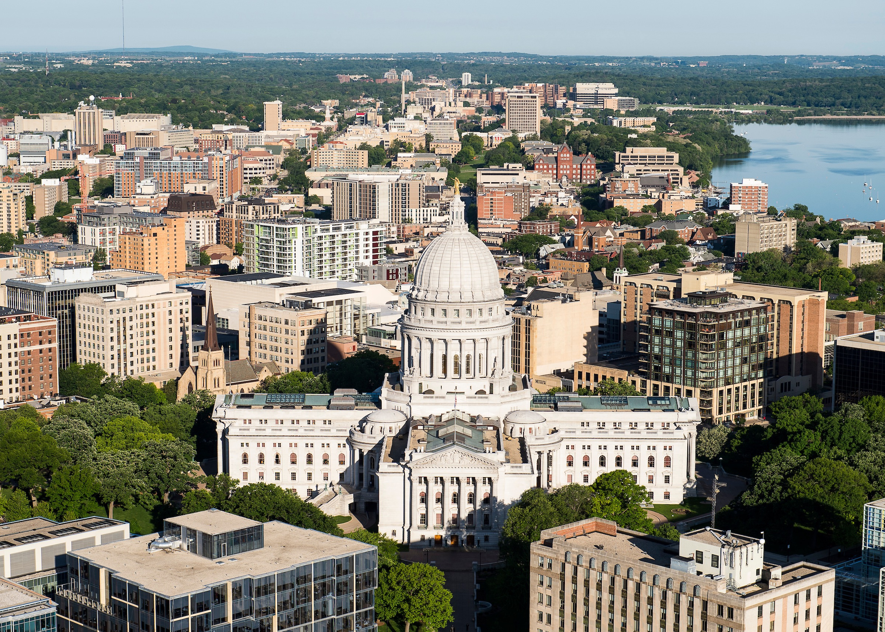
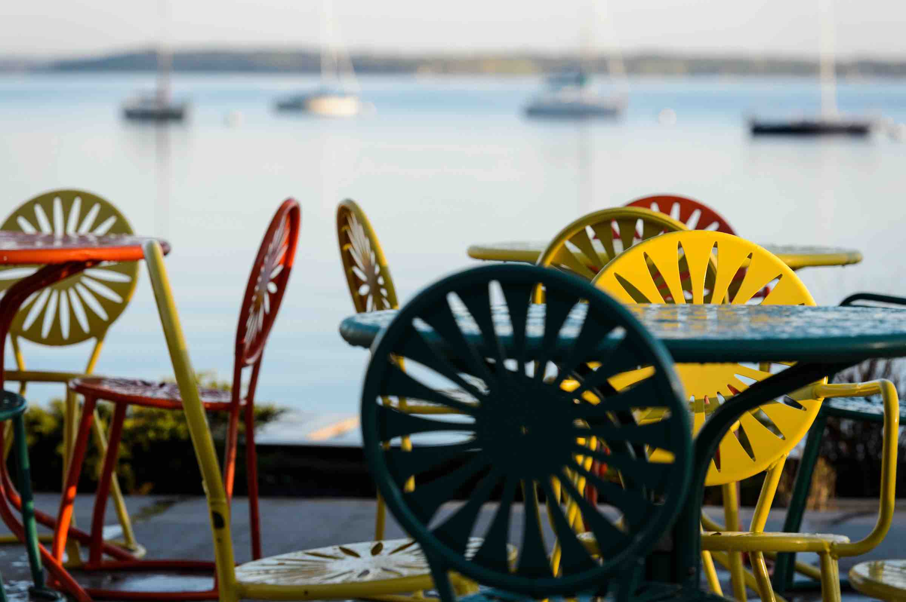
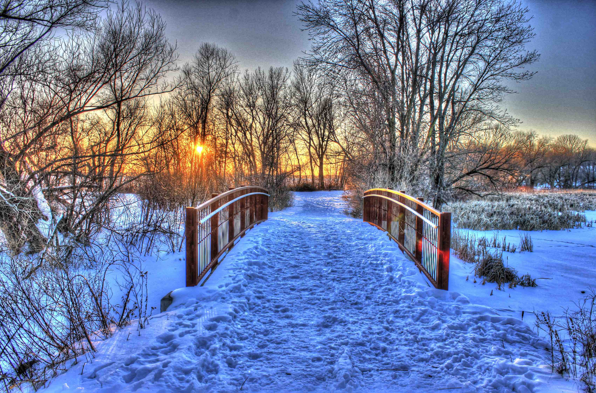

# Housing in Madison

Searching for housing can be a stressful time. Fortunately, the UW Law School has
a fairly complete, unofficial housing guide publically available on the web.
It's a great introduction to the apartment hunting process and the neighborhood
vibes around Madison.

* [An Introduction to the Madison
  neighborhoods](https://law.wisc.edu/admitted/neighborhoods.html) with some
  idea of what your surrounding amenities and daily commute will be like, along
  with some monthly rent estimates. One popular area left out of the guide is
  the Hilldale Shopping Area apartments; it is a very lively part of town with
  a nearby mall, Target, Whole Foods, and a convenient 20 minute bus commute to the Medical Sciences Building. This area to be popular amongst
  international students.
* [The Utterly Unofficial Housing Guide](https://law.wisc.edu/admitted/housingguide.html) has links to the most popular house aggregating search tools, a step through of the process and some advice from other graduate students.

# Things to do in Madison

Wisconsin's pride is predominantly comprised of beer, cheese and football, but those are not the only things Madison has to offer! Here are some quick highlights to check out.

### General Hotspots

* State Street
* Capitol/Downtown
* Union Terrace
* Williamson (Willy) Street
* Dane County Farmer's Market

#### Outdoor

* Olbrich Botanical Gardens
* UW Arboretum
* Pheasant Branch Conservancy
* Henry Vilas Zoo
* Picnic Point
* Allen Centennial Garden
* Tenney Park
* Lake Kegonsa State Park
* Devil's Lake State Park

#### Food & Drinks

* Ice cream: Babcock Hall Dairy Store (The Daily Scoop), Chocolate Shoppe Ice Cream, Kilwins
* Madison Pub Food: Great Dane's, Old Fashioned, Dotty Dumpling's Dowry
* Brunch: Bassett Street Brunch Club, Marigold Kitchen, Sunroom Café, Mickies Dairy Bar, Bradburys
* Coffee/Tea : Colectivo, Barriques, Sencha Tea Bar, Kung Fu Tea, Ancora Coffee Roasters, Johnson Public House
* Breweries: Karben4, One Barrel, Ale Asylum... Too many to list. ;)
* Late Night Grub: Ian's Pizza, Paul's Pel'meni, Insomnia Cookies

#### Shows/Performances

* Majestic Theatre
* Orpheum Theater
* Overture Center for the Arts
* High Noon Saloon
* Bartell Theatre

#### Where to find more

* [Isthmus](https://isthmus.com): Website for local happenings
* [Trip Advisor](https://www.tripadvisor.com/Attractions-g60859-Activities-Madison_Wisconsin.html)
* [Yelp](https://www.yelp.com/search?find_desc=Food&find_loc=Madison,+WI)
* [Official Wisconsin Tourism Website](https://www.travelwisconsin.com/)
